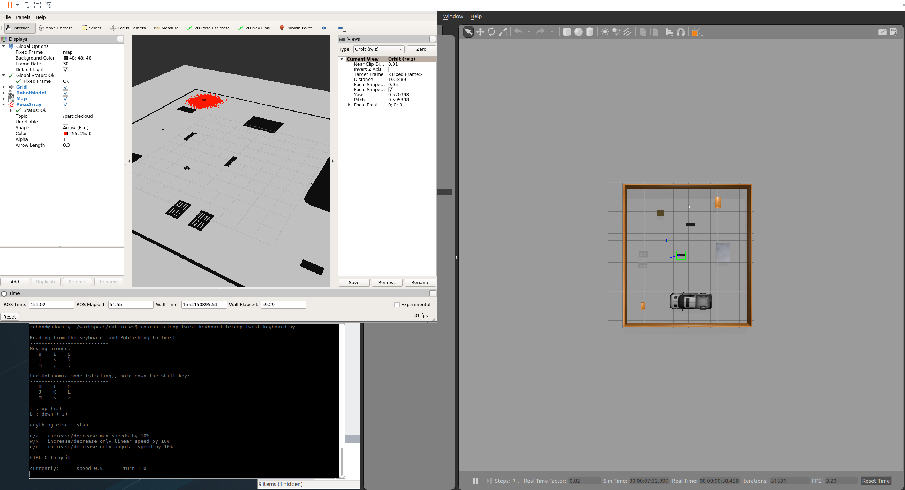
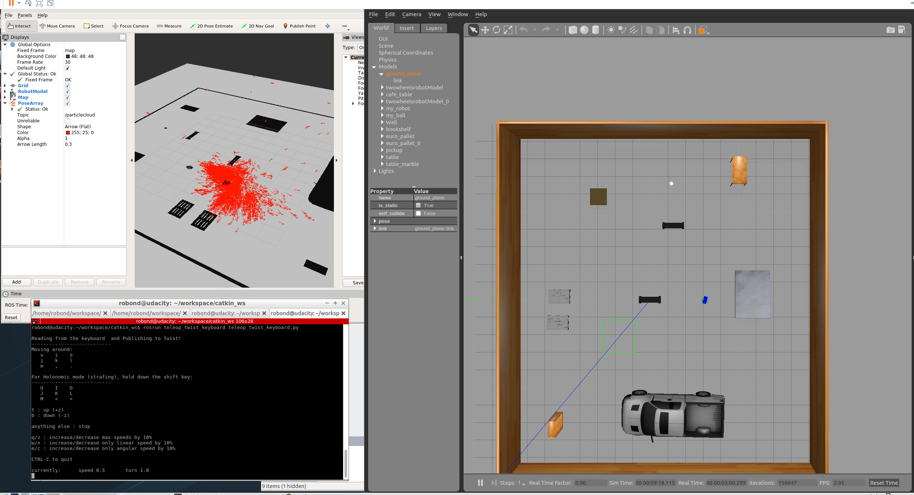
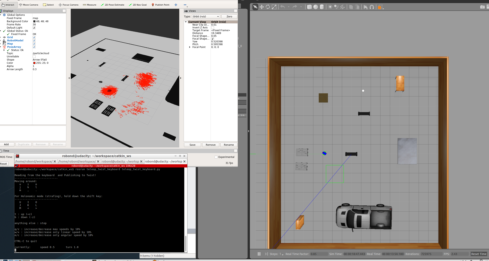
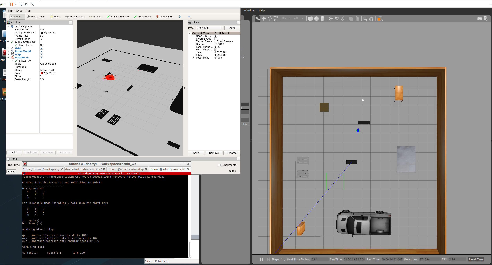
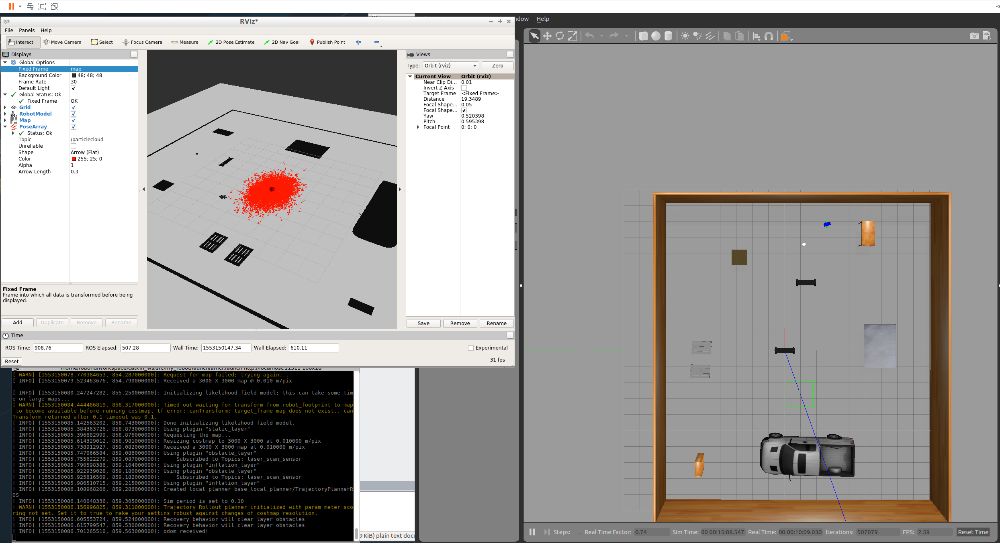
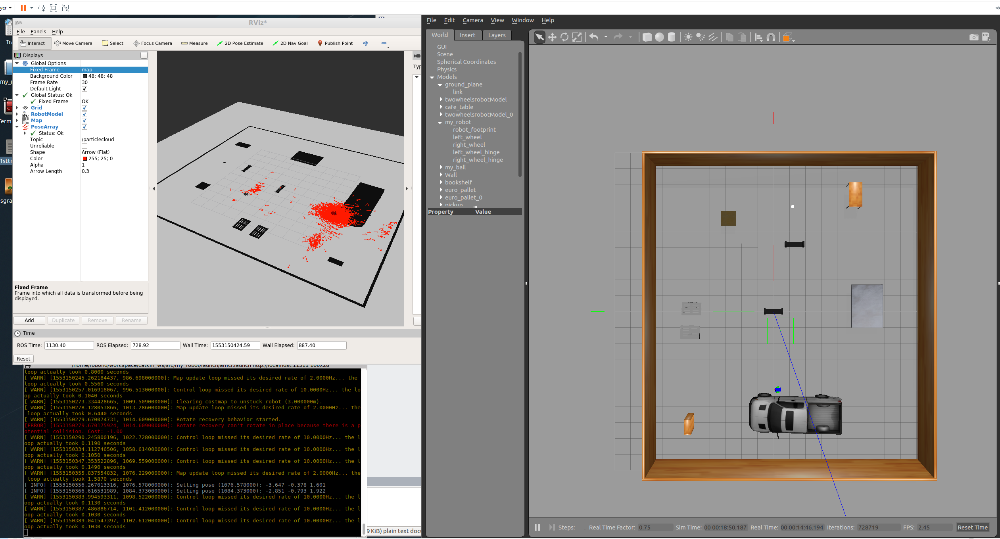

# GazeboWorld

[](https://www.udacity.com/robotics)

# RoboND-Where Am I!
The **Where Am I** project is to deploy robot in a world full of features. The robot initial pose could be completely off, however, after applying AMCL (Adaptive Monte Carlo Localization) after each movement and measurement, the robot slowly localizes itself at the right pose.

There are several packages to make this work. `map_server` package to load and publish the map. `amcl` package which takes the odom and sensor measurement data and perform localization. For odom data, it can either come from using the `teleop_twist_keyboard` package or `move_base` package. For sensor measurement, it comes from reading the laser scan data and compare it to the loaded map from `map_server` package. Lastly, we can use either the `teleop_twist_keyboard` package to tele-operate the robot or use the `move_base` package to set navigation goal for robot to navigate.

### Directory Structure
```
    .Project                           # Go Chase It Project
    ├── my_robot                       # my_robot package                   
    │   ├── launch                     # launch folder for launch files   
    │   │   ├── robot_description.launch
    │   │   ├── world.launch
    │   │   ├── amcl.launch
    │   ├── config                     # config folder for config files   
    │   │   ├── base_local_planner_params.yaml
    │   │   ├── costmap_common_params.yaml
    │   │   ├── global_costmap_params.yaml
    │   │   ├── local_costmap_params.yaml
    │   ├── meshes                     # meshes folder for sensors
    │   │   ├── hokuyo.dae
    │   ├── urdf                       # urdf folder for xarco files
    │   │   ├── my_robot.gazebo
    │   │   ├── my_robot.xacro
    │   ├── maps                       # maps folder for map files
    │   │   ├── gazeboworld1.pgm
    │   │   ├── gazeboworld1.yaml
    │   ├── world                      # world folder for world files
    │   │   ├── gazeboworld1.world
    │   ├── CMakeLists.txt             # compiler instructions
    │   ├── package.xml                # package info
    ├── pgm_map_creator                # pgm_map_creator package                   
                             
```

### Using `teleop_twist_keyboard` to move robot

#### Steps:
* Initially, it can be seen the robot is near the middle of the world, but the initial guess pose is at the corner, so way off.

* After moving the robot a bit, it shows that the robot is less confident where it is with particles all over the place.

* After a while, the robot has two main places that it believes where it is and finally jumps from the wrong place to the right place. Notice this is best to be seen in the `map` frame instead of `odom` frame, as `map` frame allows discrete change in pose but `odom` is usually continous change.

* Finally, the robot localizes itself at the right location with high confidence.


### Using `move_base` to move robot

#### Steps:
* Again, initially, the robot is near the edge of the room, but it thinks it is at the center of the room.

* After moving the robot a while, it finally localizes itself.


### Future Steps

* The features in this world are still quite few, so it can take a while and find the sweet spot (with rich features) to localize itself. Suspect adding more furnitures would help.
* Did not play with the settings of the `amcl` package too much, changing some parameters may help.