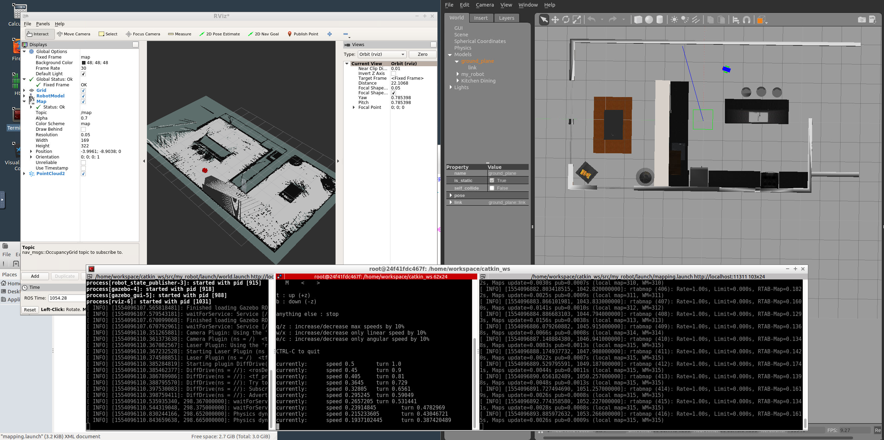
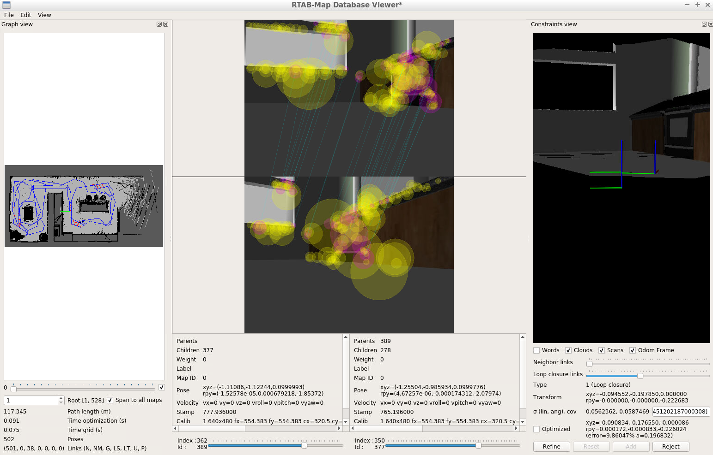
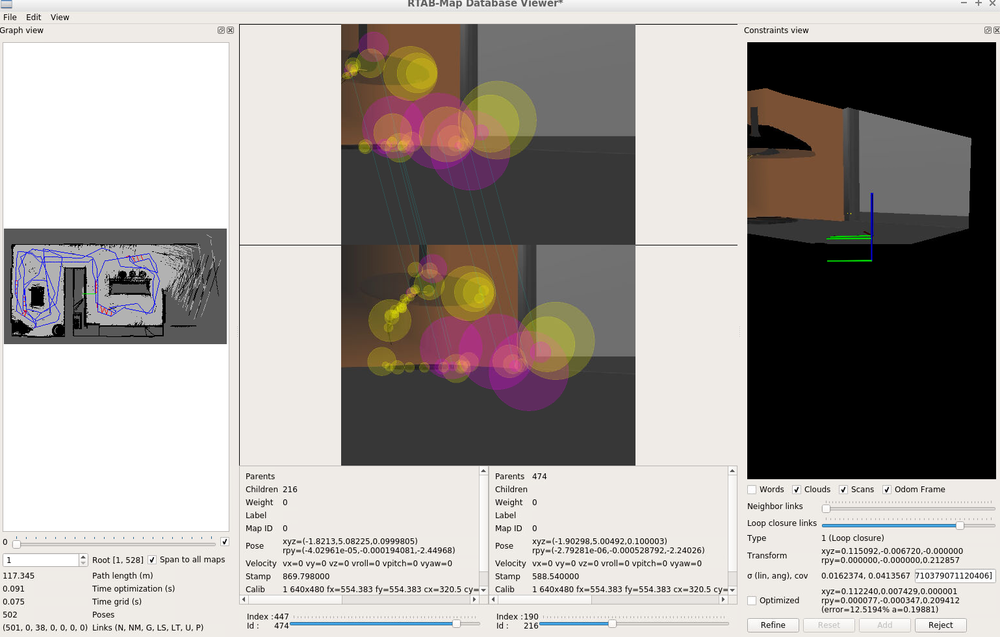
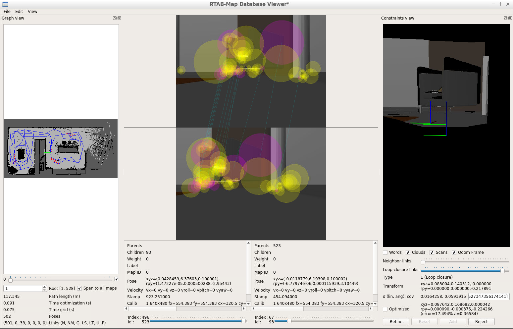
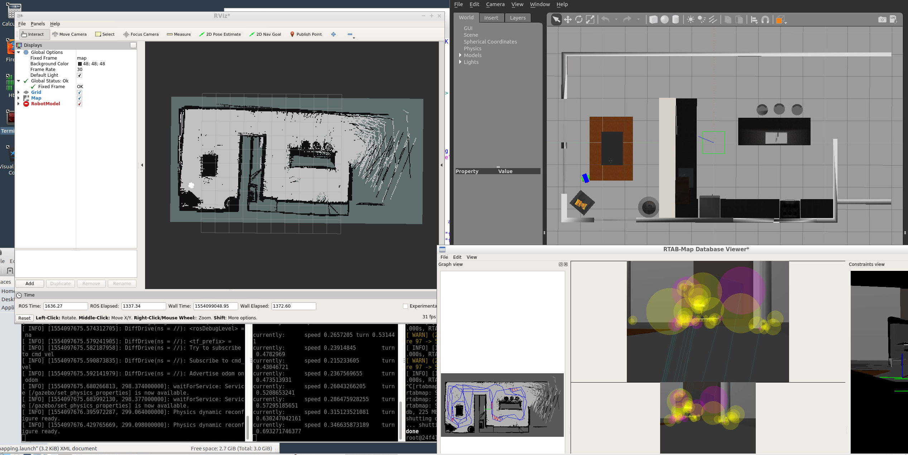

# GazeboWorld

[](https://www.udacity.com/robotics)

# RoboND-Map My World!
The **Map My World** project is to do a graph based SLAM to map an unknown world. The package we use is `RTAB-Map`.

There are several packages to make this work. `my_robot` package to launch the world (world2map.world in this case). `rtabmap` package which takes the odom (motion), depth sensor measurement (measurement), and rgb (correspondence for loop closure) data and perform graph-based SLAM. Lastly, `teleop_twist_keyboard` package is used to move the robot.

### Directory Structure
```
    .Project                           # Go Chase It Project
    ├── my_robot                       # my_robot package                   
    │   ├── launch                     # launch folder for launch files   
    │   │   ├── robot_description.launch
    │   │   ├── world.launch
    │   │   ├── mapping.launch
    │   ├── meshes                     # meshes folder for sensors
    │   │   ├── hokuyo.dae
    │   ├── urdf                       # urdf folder for xarco files
    │   │   ├── my_robot.gazebo
    │   │   ├── my_robot.xacro
    │   ├── world                      # world folder for world files
    │   │   ├── world2map.world
    │   ├── CMakeLists.txt             # compiler instructions
    │   ├── package.xml                # package info
    ├── teleop_twist_keyboard          # teleop_twist_keyboard package                   
                             
```

### Using `RTAB-Map` package to perform SLAM

#### Steps:
* After launching the world (which in this case is the kitchen model), teleop_keyboard and rtabmap package, we drive robot around to generate the map. Notice that the `Grid/3D` and `Grid/FromDepth` parameters in the `rtabmap` package have to be true. Otherwise the map is not updated. (Maybe only one of these two parameters needs to be true)

* While driving robot around, terminal will display time to time that it rejects a loop closure because the number of matching features has not reached threshold (15). Keep driving robot until the whole map is filled.
* After finishing driving robot around, close the rtabmap terminal and a `.db` file should be saved under `/root/.ros` folder. Run this command to view the file: `rtabmap-databaseViewer ~/.ros/rtabmap.db`. My db file size is around 225 MB, and can be downloaded from [here](https://www.amazon.com/clouddrive/share/JEVrLQkPEMqEXpeWf4og44LQVGOPVH3Uja91RRApwdv).
* We can see that there are 502 frames and 38 global loop closures. Below are three examples of global loop closures which we will look at the features closely soon.






* From the images we can see that the features are usually at corners, places with color changes or contour of specific shapes. Larger the purple circle is, higher confidence there is a match.
* Finally, we can display everything flat to look from top down.


### Future Steps

* Not sure if the terminal outputs when there is a loop closure detected. Right now have to blindly drive around and hope there are enough loop closures.
* The map generated still has some noise after roaming robot around a few times. Is this related to the depth sensor resolution is not high enough?