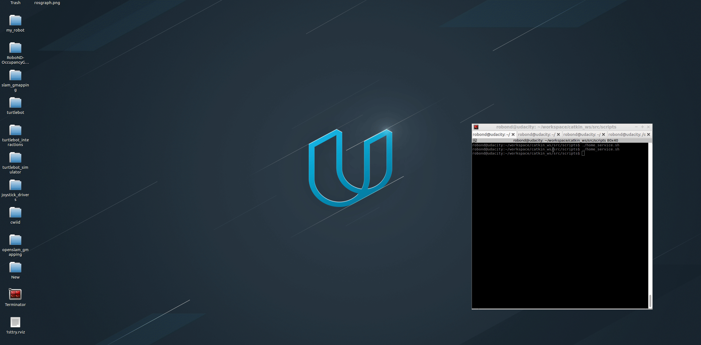

# GazeboWorld

[](https://www.udacity.com/robotics)

# RoboND-Home Service Robot!
The **Home Service Robot** project is to combine multiple packages (`slam_gmapping` for SLAM, `turtlebot` for turtlebot description and teleoperation, `turtlebot_interactions` for rviz config and markers, `turtlebot_gazebo` for launching the world and using amcl for localization, and `turtlebot_navigation` for navigation). The `turtlebot_navigation` package source files are not included, and the `dwa_local_planner_params.yaml` within this package needs to be changed to better control the robot.

Several script files were also created to test sub-tasks. Please see the directory structure below for more information.

### Directory Structure
```
    .Project                           # Home Service Robot Project
    ├──                                # Official ROS packages
    |
    ├── slam_gmapping                  # gmapping_demo.launch file                   
    │   ├── gmapping
    │   ├── ...
    ├── turtlebot                      # keyboard_teleop.launch file
    │   ├── turtlebot_teleop
    │   ├── ...
    ├── turtlebot_interactions         # view_navigation.launch file      
    │   ├── turtlebot_rviz_launchers
    │   ├── ...
    ├── turtlebot_simulator            # turtlebot_world.launch file 
    │   ├── turtlebot_gazebo
    │   ├── ...
    ├── turtlebot_navigation           # system installed navigation package for turtlebot 
    │   ├── param
    │       ├── dwa_local_planner_params.yaml      # this file needs to be modified to have proper control and Goal Tolerance Parameters
    │       ├── ...
    ├──                                # Your packages and direcotries
    |
    ├── map                            # map files
    │   ├── ...
    ├── scripts                        # shell scripts files
    │   ├── add_marker.sh
    │   ├── home_service.sh
    │   ├── pick_objects.sh
    │   ├── test_navigation.sh
    │   ├── test_slam.sh
    │   ├── ...
    ├──rvizConfig                      # rviz configuration files
    │   ├── navigation_with_marker.rviz  # Notice this rviz file is also saved under turtlebot_interactions/turtlebot_rviz_launchers/rviz/ which is the one being called.
    ├──pick_objects                    # pick_objects C++ node
    │   ├── src/pick_objects.cpp
    │   ├── ...
    ├──add_markers                     # add_marker C++ node
    │   ├── src/add_markers.cpp
    │   ├── ...
    ├──home_service                    # home_service C++ node
    │   ├── src/home_service.cpp
    │   ├── ...
    └──                   
                             
```

### Explaination of each script

#### `test_slam.sh`:
* Use `turtlebot_world.launch` to deploy a turtlebot in the environment.
* Use `slam_gmapping.launch` to perform SLAM.
* Use `view_navigation.launch` to view map in rviz. Notice there is no map pre-loaded.
* Use `keyboard_teleop.launch` to drive robot around to generate map.

#### `test_navigation.sh`:
* Use `turtlebot_world.launch` to deploy a turtlebot in the environment.
* Use `amcl_demo.launch` to perform localization. This will call map_server to load a map.
* Use `view_navigation.launch` to view map in rviz and send 2D nav goal to robot. A map is pre-loaded.

#### `pick_objects.sh`:
* Use `turtlebot_world.launch` to deploy a turtlebot in the environment.
* Use `amcl_demo.launch` to perform localization. This will call map_server to load a map.
* Use `view_navigation.launch` to view map in rviz. A map is pre-loaded.
* Use `pick_objects.cpp` to go to two goal positions.

#### `add_markers.sh`:
* Use `turtlebot_world.launch` to deploy a turtlebot in the environment.
* Use `amcl_demo.launch` to perform localization. This will call map_server to load a map.
* Use `view_navigation.launch` to view map in rviz. A map is pre-loaded.
* Use `add_markers.cpp` to display marker between two goal positions.

#### `home_service.sh`:
* Use `turtlebot_world.launch` to deploy a turtlebot in the environment.
* Use `amcl_demo.launch` to perform localization. This will call map_server to load a map.
* Use `view_navigation.launch` to view map in rviz. A map is pre-loaded.
* Use `pick_objects.cpp` to go to two goal positions.
* Use `home_service.cpp` to pick up the marker at one position and drop it off at the other position.

The `home_service.sh` script eventually looks like this:

